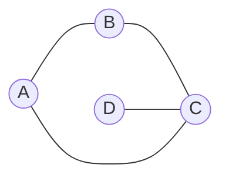

# Sample Test 1 Question 19


### Related Topics
- Recursive functions

## Warmup Questions
1. Have a look at the following pseudocode: 
``` python
function g(n):
	if n = 0 return n
	else return 2 * g(n-1);
```
What is the purpose of this function? What are the conditions on $n$ required for this function to work?


2. A game of Chinese Whispers is played in time steps. $A$ begins by telling a secret to her friends. Then her friends, in the same time step, tell the secret to all their friends. This continues until everyone knows the secret.
If an edge on the following graph represents friendship, who is the last to know of the secret and in how many time steps?




3. Convert the reccurence $h$ into a closed form expression i.e. a function in terms of $n$.
$$
    \begin{array}{l}
    h(0)=0\\
    h(n)=h(n-1) +1
    \end{array}
$$

## CSAT Question

  Let $f$ be the recursive function below, with $f(1)=f(0)=0$. What is the value of $f(1337)$?
  $$
    \begin{array}{l}
    f(n)=f(n-1)-1 \qquad\text{ if $n$ is divisible by 2 or 3 }\\
    f(n)=f(n-2)+2 \qquad\text{ otherwise}
    \end{array}
$$

## Hints

1. Lets think of $f(n)$ as a program rather than a mathematical function. Try tracing out the steps taken by this program. 

1. What number may relate to both $3$ and $2$?

1. Knowing that $6$ is the lowest common multiple of $2$ and $3$, what can you say about $6$ consecutive digits?

1. If groups of $6$ repeat, how many groups are there?

1. Without knowing the actual value of $n$, if I told you $n$ is divisible by $6$ and $n > 100$, could you work out next steps taken by the program? 


## Solution
We begin by tracing the reccurence.
Firstly, $1337$ is not divisible by $2$ or $3$. We therefore have:

$1337-2=1335$ which is divisible by $3$, then
$1335-1=1334$ which is divisible by $2$, then
$1334-1=1333$ which is not divisible by $2$ or $3$, then
$1333-2=1331$ which is not divisible by $2$ or $3$, then
$1331-2=1329$ which is divisible by $3$, then
$1329-1=1328$ which is divisible by $2$, ...

By plugging in the numbers, we notice that the sequence $(-2,-1,-1,-2)$ repeats every for $6$ consecutive numbers. 

:::info
_Not convinced?_
Consider that the lowest common multiple of $3$ and $2$ is $6$. Therefore, a multiple of both $3$ and $2$ occur every $6$ numbers. 
In fact, for any arbitrary $6$ consecutive integers, one number is divisible by both $2$ and $3$, one is divisible by $3$ but not by $2$, two are divisible by $2$ but not by $3$, and two are divisible by neither $2$ nor $3$. 
By starting from a number that is divisible by neither $2$ or $3$ (like $1337$), our pattern, $(-2,-1,-1,-2)$, yet again unfolds. Test this out!
:::

Now, we wish to find the number of times this pattern actually occurs. In whole, it occurs $\lfloor1337/(2+1+1+2)\rfloor=222$ times, which gives a remainder of 5. So, we have:
$$
\begin{array}{l}
    f(1337)\\
    =222(+2-1-1+2)+f(5)\\
    =444+f(3)+2\\
    =444+f(2)-1+2\\
    =444+f(1)-1-1+2\\
    =444
    \end{array}
$$